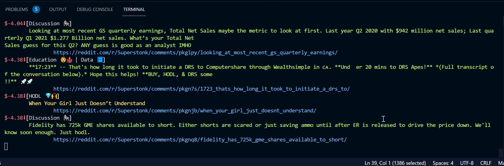
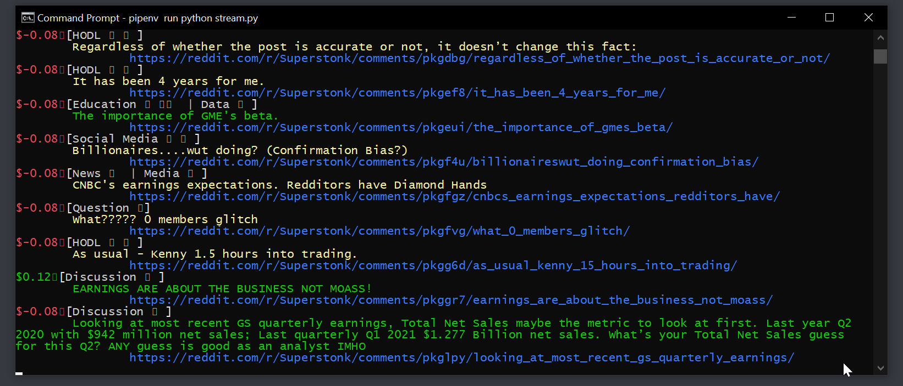
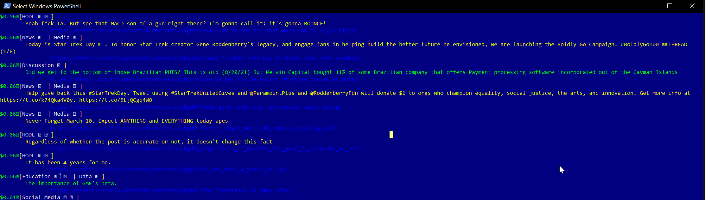

# Intro

I don't really do support, but if something is really broken/confusing shoot me a note @devdevgoat or u/devdevgoat. This works best when run in VS codes virtual shell:





# Notes:

    - link clicking doesn't seem to work in powershell/cmd
    - havent tried on mac yet
    - price action only updates from the time you run the app, so on first run everything will show 0.00 change most likely. I could change this to price from open... but don't want to parse the data frame yet, maybe later.

# Setup

1. You'll need to get a reddit api key and secret by doing the following here: https://redditclient.readthedocs.io/en/latest/oauth/
2. Rename the file "example.env" to ".env" without the quotes
3. Replace the client_id, secret with the values from step 1, and add your user and password. Optionally enable fluff posts by setting show_fluff=True (with captial 'T')
4. Install python 3.9+
5. Install pipenv:

    ```pip install --user pipenv```

6. Download this repo, and from the parent directory install the dependancies:

    ``` pipenv install ```

7. Run the app from pipenv shell:

```bash
pipenv shell 
python stream.py
```

   or from terminal:

``` pipenv run python stream.py ```
